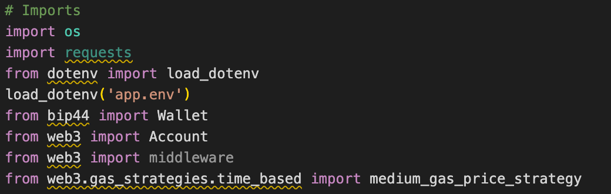
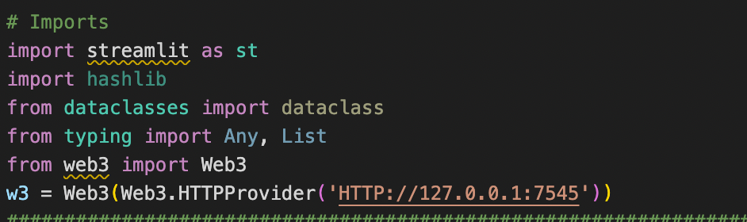
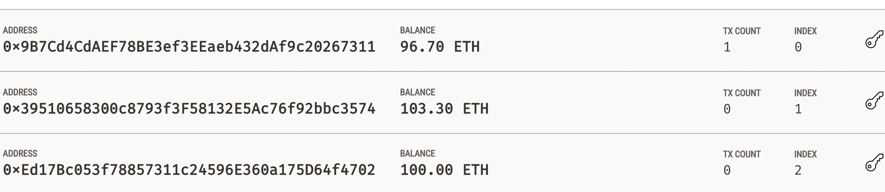
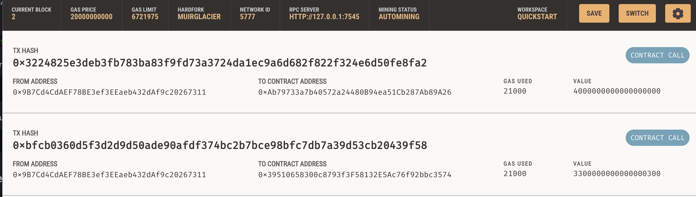

# fintech_finder

---
## Technologies 

* [pandas](https://github.com/pandas-dev/pandas) - For data analysis and manipulation.
* [streamlit](https://github.com/streamlit/streamlit) - For frontend UI
* [hashlib](https://docs.python.org/3/library/hashlib.html)
* [dataclasses](https://docs.python.org/3/library/dataclasses.html)
* [ganache](https://trufflesuite.com/ganache/)
 -- 
## Imports and Installations

        '''

        import streamlit as st
        from dataclasses import dataclass
        from typing import Any, List
        import datetime as datetime
        import pandas as pd
        import hashlib 
        pip install web3==5.17
        pip install eth-tester==0.5.0b3
        pip install mnemonic
        pip install bip44

        '''

---

## Crypto_wallet.py imports 

## fintech_finder.py imports 

--- 

## Carrying out and Confirming Transactions 

From your terminal, navigate to the project folder that contains your .env file and the fintech_finder.py and crypto_wallet.py files.
To launch the Streamlit application type the following:
       
       ''' streamlit run fintech_finder.py '''
        
On the resulting webpage, select a candidate that you would like to hire. Then, enter the number of hours that you would like to hire them for.
Click the Send Transaction button to sign and send the transaction with your Ethereum account information.
Navigate to the Ganache accounts tab and locate your account .
Navigate to the Ganache transactions tab and locate the transaction.

---

## Images 

---
## Contributors

The starter code was contributed by the [FinTech Bootcamp at Columbia Engineering](https://bootcamp.cvn.columbia.edu/fintech/)

Matthew Field finalized the application, his work is availble to view on [Github](https://github.com/mbf2139)

---
## License

MIT